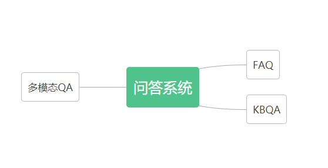

**简体中文**🀄 | [English🌎](./README_en.md)

# 问答系统

------------------------------------------------------------------------------------------
## 目录

- [问答系统分类](#问答系统分类)
- [常见问答系统](#常见问答系统)
  - [常见QA定义](#常见QA定义)
  - [内容框架](#内容框架)
    - [1.FQA](#1.FQA)
      - [1.1 FQA流程](#1.1 FQA流程)
      - [1.2 FQA常用方案](#1.2 FQA常用方案)
      - [1.3 QQ匹配为什么会常用？](#1.3 QQ匹配为什么会常用？)
      - [1.4 QQ匹配的常用技术方案](#1.4 QQ匹配的常用技术方案)
      - [1.5 代码实现](#1.5代码实现)
        - [1.5.1 word2vec](#1.5.1 word2vec)
        - [1.5.2 sentence_bert](#1.5.2 sentence_bert)
    - [2.KBQA](#2.KBQA)
    - [3.多模态QA](#3.多模态QA)

## 问答系统分类

- 1.根据回答类型分类：
    - **检索式问答**：
      检索式问答系统通过在数据库或者知识库中查找相关信息，给出答案。
    - **生成式问答**：
      生成式问答系统则根据问题的意思，通过自然语言生成模型，生成答案。
    
- 2.根据交互方式分类：
    - **多轮问答**：多轮对话可以与用户进行深度交互。
    - **单轮问答**：单轮问答系统只进行一次回答。

- 3.根据领域分类：
  - **通用问答**：通用问答系统可以回答各种问题。
  - **垂直领域问答**：特定领域问答系统只能回答某个特定领域的问题。
  
- 4.根据答案来源的不同：
  - **基于知识库的问答**：答案来源于一个事先建立好的知识库或者数据库，通过检索相关信息来回答问题。这种问答系统通常用于回答特定领域的问题。
  比如FQA和KBQA
  - **基于文本的问答**： 答案来源于文本数据，通常是互联网上的文本，通过对文本的理解和分析，来回答问题。

## 常见问答系统

### 常见QA定义

- **FQA**：FQA是面向论坛型社区的问答系统，其目标是回答涉及广泛主题的非事实性问题。FQA系统通过利用社区中已有的问题和回答，以及用户生成的标签、评论等信息，来实现对新问题的回答。FQA系统中还常常涉及到用户建模、答案排序和评论等功能。

- **KBQA**：KBQA是基于知识库的问答系统，其目标是回答涉及特定领域的事实性问题。KBQA系统通过将自然语言问题翻译成知识库中的查询语言，来实现对知识库中的信息进行查询和推理，并将查询结果转化为自然语言进行输出。

- **多模态QA**：多模态QA是涉及多种形式的数据（如文本、图像、音频、视频等）的问答系统。多模态QA系统通过将不同形式的数据结合起来，实现对用户提问的回答。多模态QA系统中需要解决的关键问题包括多模态数据的表示、融合和交互，以及如何将多模态数据与自然语言处理技术相结合。

## 1.FQA
FQA:Frequently-Questions-Answer

FAQ:Frequently-Asked-Questions

两种叫法一个意思，大家哪个顺嘴就叫哪个

### 1.1 FQA流程
检索式问答系统是一种**基于信息检索技术**的问答系统，它通过在**数据库或知识库**中查找相关信息，来回答用户提出的问题。

通常情况下，检索式问答系统的流程如下：

- 问题分析：对用户提出的问题进行分析和解析，确定问题的类型、关键词和意图。这个步骤通常使用自然语言处理技术，如分词、命名实体识别等。

- 信息检索：根据问题的关键词，在数据库或知识库中查找相关信息。通常使用信息检索技术，如倒排索引、语义匹配等。检索的结果通常是一个候选答案列表。

- 答案排序：对候选答案进行排序，确定最可能的答案。排序通常基于答案的相关性、可信度等指标。

- 答案生成：根据排序后的答案列表，生成一个或多个答案，并返回给用户。答案的生成通常包括对检索结果的摘要和组织，以便让用户更容易理解。

需要注意的是，由于检索式问答系统是基于预先构建好的信息库，因此它的应用场景受到信息库的限制，无法回答一些比较复杂和抽象的问题。此外，检索式问答系统的准确性和效率高，但在回答问题的灵活性和交互性方面则可能存在一定的局限性。

在检索式问答系统中，信息检索技术通常采用倒排索引技术，即将每个单词与包含该单词的文档列表进行映射，然后通过计算查询与文档的相关性得分，将文档进行排序。此外，为了更好地匹配用户查询和文档，检索式问答系统还可以使用语义匹配技术，如词向量模型、主题模型等。

信息检索技术是检索式问答系统的核心，其效果的好坏直接影响到系统的准确性和效率。

### 1.2 FQA常用检索方案
**QQ匹配**和**QA匹配**是FQA中常用的两种检索匹配方式。

- QQ匹配是指Question-Question匹配，即将用户提出的问题与已有的问题库进行匹配，找到与之相似的问题，并返回对应的答案。 QQ匹配的优点在于可以利用已有的问题库来提高答案的准确性和召回率，但缺点是对于新问题或者与现有问题差异较大的问题，可能无法找到对应的答案。
  QQ匹配比较常用是因为对于一些常见的问题，已经有了相应的问题库，并且这些问题库的规模比较大，能够覆盖很多领域和方面的问题。因此，通过QQ匹配可以利用已有的问题库来提高答案的准确性和召回率。

- QA匹配是指Question-Answer匹配，即将用户提出的问题与已有的答案库进行匹配，找到最匹配的答案并返回给用户。QA匹配的优点在于能够直接返回答案，因此适用于那些已有标准答案或者答案可以直接推导出来的问题，如数学问题等。但缺点是对于开放性的问题或者涉及复杂推理的问题，QA匹配可能无法提供满意的答案。

在实际工业应用中，QQ匹配用的最多，QQ匹配和QA匹配也可以结合使用，以发挥各自的优势。
QQ匹配可以先利用问题库进行筛选，提高答案的准确性和召回率，然后再通过QA匹配对剩余的问题进行回答。

### 1.3 QQ匹配为什么会常用？
QQ匹配有以下几个技术优点：

- **简单有效**：QQ匹配不需要进行复杂的NLU，只需要对问题进行关键词提取和匹配即可，因此实现起来比较简单，效果也比较明显。

- **速度快**：QQ匹配利用了已有问题库中的问题进行匹配。这些问题库通常规模比较大，覆盖了很多领域和方面的问题，因此可以通过基于索引的方式（比如用ES进行初步的召回）快速定位到相似的问题，而不需要逐一计算问题的相似度。
相比之下，QA匹配需要在用户提问和已有问题之间计算相似度，需要进行复杂的自然语言处理和语义理解，计算量较大，因此相对来说速度会慢一些。

- **稳定性高**：QQ匹配是基于已有的问题库进行匹配，因此匹配结果相对稳定，不会受到用户提问的影响。这也使得QQ匹配在一些需要高精度答案的场景中具有优势，如客服、专业领域等。

- **易于扩展**：由于QQ匹配的核心是问题库的构建和维护，因此可以通过不断添加新的问题和答案来扩展问题库，从而提高答案的准确性和召回率。
例如一条标准问可以对应多条问法，这个可以通过运营人员或者业务专家根据实际业务需要进行自由的增删改查，更方便快捷。

- **可解释性强**：QQ匹配的输出结果是与问题库中已有的问题相似度较高的问题和答案，因此结果具有很强的可解释性，用户可以直接理解和评估。

- **专业领域效果好**：对于一些已有标准答案或者问题比较明确的领域，如法律、医疗、金融等，QQ匹配可以实现较高的准确度和召回率。

### 1.4 QQ匹配的常用技术方案
- **语料库构建**：首先需要构建问题库，这个问题库通常是由领域专家或者系统开发人员根据实际需求进行整理和分类，收集常见问题并整理成标准格式，以便于后续的匹配。

- **用户query预处理**：包括分词、去除停用词、同义词替换、纠错、合规审查等，以便后续的相似度计算和匹配

- **意图识别**：如果业务有多领域，这里建议加上一个多分类的意图识别，实际落地效果会好一些。

- **特征提取**：包括问题的关键词、词法分析、句法结构分析、Embedding表示（Word2vec、Bert等）等。

- **召回**：比如使用ES进行初步召回、使用faiss进行向量初步召回等

- **精排**：也叫相似度计算。这里可以使用多种相似度来计算（关键词、词向量余弦相似度等），最后进行加权处理，取Top-N作为问题答案

### 1.5 代码实现
代码包括：
- 训练/微调专业领域的词向量模型
- 工程化

数据集：CMU QA数据集：手动生成的仿真问/答对，维基百科文章对其难度评分很高。
从中选取部分QA数据来构建问答库。

- 地址：http://www.cs.cmu.edu/~ark/QA-data/

#### 1.5.1 word2vec
代码可参考[FQA/word2vec](./FQA/word2vec)
#### 1.5.2 sentence_bert
代码可参考[FQA/sentence_bert](./FQA/sentence_bert)

## 2.KBQA
KBQA（Knowledge-Based Question Answering）是基于知识图谱（Knowledge Graph）等结构化知识库的问答系统，利用先前已经构建好的知识库作为回答问题的依据，通过查询、推理等方式实现问题回答。

所以，需要构建一个知识图谱作为前置条件。
如何构建知识图谱，To be added

### 2.2 KBQA的优势
快

KBQA的优点在于可以提供更准确、更全面的答案，因为它是基于预先构建好的知识图谱的，能够直接获取知识库中的结构化信息，并且对于实体、关系和属性等概念有更深入的理解。
KBQA在需要精准答案的场景下具有优势，如智能客服、问答社区、智能搜索等领域。

以下是一些真实的例子：

-  医疗问答：用户输入“什么是糖尿病”，系统能够通过知识图谱中的医疗实体和属性信息，回答“糖尿病是一种慢性代谢性疾病，以高血糖为特征，由于胰岛素分泌不足或细胞对胰岛素反应不足导致”等问题。

-  金融问答：用户输入“什么是理财产品”，系统能够通过知识图谱中的金融实体和属性信息，回答“理财产品是由商业银行或其他金融机构提供的，通过购买固定收益类证券、货币市场工具等资产来获得收益”的问题。

-  历史文化问答：用户输入“长城修建的年代是什么时候”，系统能够通过知识图谱中的历史文化实体和属性信息，回答“长城修建的时间大致为公元前7世纪至明清时期，其中最早的大规模修筑始于战国时期”的问题。

### 2.4 KBQA的大概流程
KBQA（Knowledge-Based Question Answering，基于知识库的问答）的基本流程通常包括以下几个步骤：

-  自然语言理解（NLU）：将自然语言问题转化为计算机可处理的形式。这个步骤通常包括分词、词性标注、实体识别、句法分析等。

-  实体链接（Entity Linking）：将自然语言问题中的实体链接到知识库中的实体。这个步骤通常包括实体识别、实体消歧（Entity Disambiguation）和实体链接（Entity Linking）。

-  查询生成（Query Generation）：基于自然语言问题和已链接的实体，生成查询语句（SPARQL或其他查询语言）。

-  知识库查询（Knowledge Base Query）：使用生成的查询语句查询知识库，获取与问题相关的信息。

-  答案提取（Answer Extraction）：从查询结果中提取出最终的答案，并将其转化为自然语言形式。

-  自然语言生成（NLG）：将答案转化为自然语言形式，返回给用户。

## 3.多模态QA

经过业界调研，在多模态领域，**百度**和**微软**做的比较不错。

比如我们实际工程中使用过**百度paddlenlp的layout**，进行专业领域的微调训练与优化适配，获得不错的效果。

论文地址：https://paperswithcode.com/paper/ernie-layout-layout-knowledge-enhanced-pre

另外也可参考微软开源的项目，进行专业领域的适配应用。

微软多模态开源地址：https://huggingface.co/microsoft/layoutlmv3-base